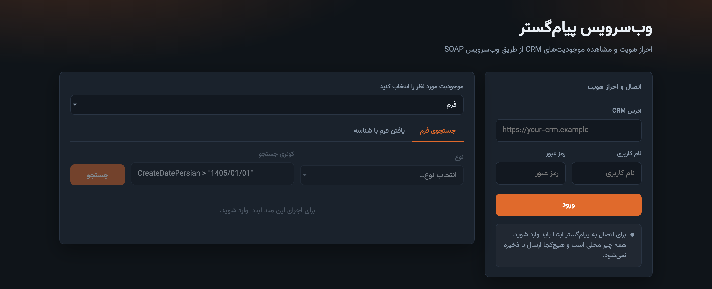

# وب‌سرویس پیام‌گستر

RTL browser UI for [PayamGostar](https://developer.payamgostar.com/soap-docs/) SOAP. Sign in with your CRM address, then search, list, and open records from the live instance.

**Demo:** [payamgostar.rahboard.com](https://payamgostar.rahboard.com)



Credentials stay in the page. They are not written to `.env`, disk, or this repo. SOAP calls go same-origin through `POST /api/soap` to the **https** CRM URL you type.

## Usage

1. Open the app and enter CRM URL, username, and password.
2. Browse entities and method tabs before login (actions stay locked).
3. After **ورود**, run search / list / find. Results paginate; pick a row for field details.

| Entity | SOAP |
| --- | --- |
| فرم | `SearchForm`, `FindFormById` |
| شخص | `SearchPerson`, `FindPersonById` |
| شرکت | `SearchOrganization`, `FindOrganizationById` |
| هویت | `SearchIdentity`, `FindIdentityById` |
| قرارملاقات | `SearchAppointment`, `FindAppointmentById` |
| وظیفه | `SearchTask`, `FindTaskById` |
| تیکت | `SearchTicket`, `FindTicketById` |
| قرارداد | `SearchContract`, `FindContractById` |
| فرصت | `SearchOpportunity`, `FindOpportunityById` |
| فاکتور | sale / quote / purchase / return variants |
| دریافت و پرداخت | `SearchPayment`, `SearchReceipt`, find-by-id |
| تماس تلفنی | `SearchPhoneLog`, `FindPhoneLogById` |
| یادداشت | `GetBusinessNote` |
| محصولات | `FindProductByName`, `FindProductById` |
| موجودی انبار | `GetRemainingStock` |
| کاربران | `GetUserList`, `GetUser` |
| حساب‌های مالی | `GetMoneyAccountList` |
| انواع موجودیت | `GetCrmObjectTypeList` |
| کارتابل | `GetCardtable` |

Default search query: `CreateDatePersian > "1405/01/01"`.

## Run

```bash
python3 server.py
# http://127.0.0.1:8080/
```

```bash
docker compose up -d --build
```

Optional `.env` keys: `PUBLISH_PORT`, `SOAP_TIMEOUT`. Do not put CRM URL or passwords there.

## Layout

- `index.html` / `app.js` — UI and SOAP XML
- `server.py` — static files + SOAP gateway (`GET /health`, `POST /api/soap?base=&path=`)
- `docker-compose.yml` — `payamgostar-api` on port `8080`
